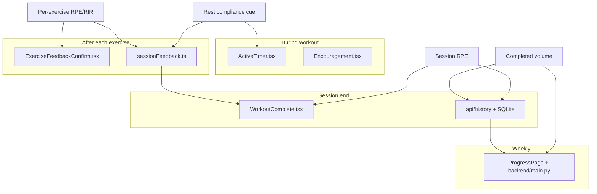

# Exercise feedback evidence brief

**Purpose:** Identify which exercise feedback matters most for adherence and progression, then recommend what Gym Timer should implement next.  
**Scope:** Recreational resistance / work–rest training; tap-only web UX preferred; no wearables required for near-term features.  
**Date:** 2026-07-23  
**Status:** Research only — no product code changes in this deliverable.

---

## Current app baseline

Today the app already captures **behavioral compliance** and turns it into tips:

| Signal | Source |
|--------|--------|
| Completed / skipped series | Timer FSM |
| Pause count / pause seconds | Timer FSM |
| Skipped rest | Timer FSM |
| Strength / weakness / neutral | [`src/utils/sessionFeedback.ts`](../src/utils/sessionFeedback.ts) heuristics |
| Session tips | Same file + [`WorkoutComplete.tsx`](../src/components/WorkoutComplete.tsx) |
| Weekly KPIs | [`backend/main.py`](../backend/main.py) `/api/kpis/weekly` |

**Not tracked:** RPE/RIR, session RPE, actual completed reps, rest duration vs prescription, load/weight, readiness, heart rate, form/velocity.

---

## Research questions answered

1. **During session:** Rest compliance and knowledge-of-results (what you completed) matter; velocity/form feedback helps but usually needs sensors.
2. **Between sets / after exercise:** RPE/RIR is the strongest tap-only intensity signal for autoregulation.
3. **After session / weekly:** Session RPE × duration (training load) and completed weekly set volume drive monitoring and progression decisions.
4. **High evidence + low friction:** Session RPE, per-exercise RPE/RIR, planned-vs-completed series/reps, and rest compliance reuse existing timer data.

---

## Key literature (selected)

### Autoregulation / RPE / RIR

- Zhang et al. (2025). *Autoregulated resistance training for maximal strength enhancement: A systematic review and network meta-analysis.* [PubMed](https://pubmed.ncbi.nlm.nih.gov/40791980/) — APRE, RPE, and VBRT outperform fixed %-based programming for max strength; RPE is a viable subjective method.
- Greig et al. (2020). *Autoregulation in Resistance Training: Addressing the Inconsistencies.* Sports Medicine. [DOI](https://doi.org/10.1007/s40279-020-01330-8) — Framework for readiness/fatigue-based adjustments.
- Helms et al. (2016). *Application of the Repetitions in Reserve-Based Rating of Perceived Exertion Scale for Resistance Training.* Strength Cond J. [PMC](https://pmc.ncbi.nlm.nih.gov/articles/PMC4961270/) — Practical RIR–RPE scale for RT.
- Zourdos et al. (2016). Novel RT-specific RPE scale measuring RIR. J Strength Cond Res.
- Larsen et al. (2025). Factors influencing RIR scale accuracy: systematic review. [DOI](https://doi.org/10.1080/10833196.2025.2564026) — Accuracy improves near failure and at higher relative loads.

### Session RPE / internal load

- Haddad et al. (2017). *Session-RPE Method for Training Load Monitoring.* Front Neurosci. [PMC](https://pmc.ncbi.nlm.nih.gov/articles/PMC5673663/) — Valid, reliable, ecological TL method across sports and ages.
- Foster et al. / historical development: sRPE ≈ intensity × duration; useful for resistance training (Day et al., 2004; Singh et al., 2007).
- Kraft et al. (2014). sRPE responds to work rate in resistance bouts; 15-min post ratings usable.

### Rest intervals

- Singer et al. (2024). *Give it a rest:* Bayesian meta-analysis on inter-set rest and hypertrophy. [PMC](https://pmc.ncbi.nlm.nih.gov/articles/PMC11349676/) — Small hypertrophy benefit for >60 s rest, largely via preserving volume load; little extra benefit beyond ~90 s.
- 2025 meta-analyses of &lt;60 s vs &gt;60 s: longer rest modestly favors strength/power; hypertrophy differences often trivial when volume is matched.

### Volume / progressive overload

- Schoenfeld, Ogborn & Krieger (2017). Dose–response of weekly RT volume and muscle mass. — Graded relationship; higher weekly sets → greater hypertrophy.
- Currier et al. / umbrella reviews (2022–2024): ~10+ weekly sets per muscle group often cited as an upper practical target; diminishing returns apply.
- Volume should be tracked as **completed** work, not only planned prescriptions.

### Self-monitoring & adherence

- Vetrovsky et al. (2022 / Lancet abstract). Self-monitoring + goals/counselling beats monitoring alone for PA.
- Berry et al. (2023). Feedback presentation improves engagement with self-monitoring. Int J Behav Nutr Phys Act. [DOI](https://doi.org/10.1186/s12966-023-01555-6)
- Burke et al. (2011). PA self-monitoring frequency linked to adherence and outcomes (MSSE).

### Augmented feedback (KR)

- Weakley et al. (2023). *Effect of Feedback on Resistance Training Performance and Adaptations.* Sports Medicine. [PMC](https://pmc.ncbi.nlm.nih.gov/articles/PMC10432365/) — Feedback improves acute velocity (~8%) and chronic adaptations; higher frequency better; visual &gt; verbal for kinematics. Mostly velocity KR — hard without sensors in this app.

### Readiness / wellness

- McLean et al.–style 1–5 wellness (fatigue, sleep, soreness, stress, mood) used widely in team sport monitoring.
- Subjective wellness often sensitive to load; single “readiness” scores can be weaker than subscales (e.g. soreness, sleep). Useful later, not MVP-critical for a recreational timer.

---

## Candidate scoring rubric

Each criterion scored **1–5** (higher = better for Gym Timer).  
**Complexity** is inverted so 5 = simplest to ship.  
**Total** = sum of five scores (max 25).

| # | Feedback type | Evidence | User value | Feasibility (taps) | Fit current model | Complexity (easy=5) | **Total** |
|---|---------------|----------|------------|--------------------|-------------------|---------------------|-----------|
| 1 | **Rest compliance** (actual vs prescribed; skip-rest rate) | 4 | 4 | 5 | 5 | 5 | **23** |
| 2 | **Session RPE** (+ optional load = sRPE × minutes) | 5 | 5 | 5 | 4 | 5 | **24** |
| 3 | **Per-exercise RPE / RIR** (1 tap after exercise) | 5 | 5 | 5 | 4 | 4 | **23** |
| 4 | **Completed vs planned reps/series** (log actuals) | 5 | 5 | 4 | 4 | 3 | **21** |
| 5 | **Weekly completed set volume** trends | 5 | 5 | 4 | 4 | 3 | **21** |
| 6 | **Progression tips from RPE + completion** (rules) | 4 | 5 | 4 | 5 | 3 | **21** |
| 7 | **Readiness / soreness (1–5) pre-workout** | 3 | 3 | 5 | 2 | 4 | **17** |
| 8 | **During-set encouragement / KR text** (non-sensor) | 3 | 3 | 5 | 4 | 4 | **19** |
| 9 | **Load / weight logging** | 4 | 5 | 3 | 2 | 2 | **16** |
| 10 | **Heart rate / HRV** | 4 | 4 | 1 | 1 | 1 | **11** |
| 11 | **Velocity-based KR / VBT** | 5 | 5 | 1 | 1 | 1 | **13** |
| 12 | **Camera form analysis** | 2 | 4 | 1 | 1 | 1 | **9** |

### Scoring notes

- **Rest compliance** scores highest on fit because the timer already records skip-rest, pauses, and prescribed rest — mostly surfacing + smarter tips.
- **Session RPE** has the strongest monitoring evidence and one end-of-workout tap.
- **Per-exercise RPE/RIR** enables better tips than pause/skip heuristics alone; prefer **per-exercise** over per-set for UX friction.
- **Completed reps** closes a real data gap (targets ≠ performance) but needs a small input UI.
- Sensor features stay in the **later / non-goals** bucket despite strong lab evidence.

---

## Ranked backlog (near-term → later)

### Near-term (tap-only)

1. Session RPE at workout complete  
2. Rest compliance feedback (reuse existing signals)  
3. Per-exercise RPE or RIR on `ExerciseFeedbackConfirm`  
4. Actual completed reps (or “hit target / −1 / −2 / failed”)  
5. Weekly completed-series volume + average session RPE in Progress KPIs  
6. Tip engine update: combine RPE + completion + rest skips  

### Later

7. Optional load/weight field  
8. Pre-workout readiness (soreness / sleep 1–5)  
9. Auto-adjust next preset (true APRE-style progression)  
10. Wearable HR / VBT / form vision  

---

## Mapping to Gym Timer surfaces

| Feedback | Primary UI | Data / logic | KPI use |
|----------|------------|--------------|---------|
| Rest compliance | [`ActiveTimer.tsx`](../src/components/ActiveTimer.tsx) rest phase; tips in confirm/complete | Already: `skip_rest_count`, pause seconds; add “% rests completed full” in [`sessionFeedback.ts`](../src/utils/sessionFeedback.ts) | Weekly skip-rest rate (partially exists) |
| Session RPE | [`WorkoutComplete.tsx`](../src/components/WorkoutComplete.tsx) 0–10 scale | Persist on history payload in [`src/api/history.ts`](../src/api/history.ts) / backend | Avg sRPE, weekly training load |
| Per-exercise RPE/RIR | [`ExerciseFeedbackConfirm.tsx`](../src/components/ExerciseFeedbackConfirm.tsx) | Extend `ExerciseFeedback` type; refine `buildTips` | Hard-set count by RPE ≥ 8; weakness if high RPE + incomplete |
| Completed reps | Confirm modal or post-set stepper | Store `completed_reps` vs planned; stop treating planned as PR | True best reps / volume |
| Progression rules | `buildTips` / `classifyVerdict` | e.g. RPE ≤ 6 + full series → add reps; RPE ≥ 9 + skips → cut volume | Surface in strengths/weaknesses |
| Encouragement | [`Encouragement.tsx`](../src/components/Encouragement.tsx) | Keep roast/motivation; do **not** pretend it is velocity KR | N/A |

---

## Recommended MVP (exactly 3 features)

Ship these first — highest evidence × feasibility × fit:

### 1. Session RPE (end of workout)

- Collect **0–10 session RPE** on the complete screen (one tap row).
- Optionally compute **session training load = sRPE × duration (minutes)** for Progress.
- Evidence: Haddad 2017; Foster lineage; Day/Singh resistance validations.

### 2. Rest compliance feedback (reuse existing data)

- Surface “skipped N of M rests” and tip when skip-rest is high *and* series incomplete.
- Soft cue during rest: “Full rest supports next-set performance” when user hits skip early (optional copy only).
- Evidence: rest &gt;60 s helps preserve volume/strength; app already owns the signal.

### 3. Per-exercise RPE (or RIR) on confirm

- After each exercise, ask **RPE 1–10** (or RIR 0–4) before Save/Discard.
- Update tip rules in `sessionFeedback.ts`:
  - High RPE + incomplete → reduce series / lengthen rest (already close)
  - Low RPE + clean finish → progress reps/series (stronger than skip-rest heuristic alone)
- Prefer **per-exercise** (not per-set) to keep friction low for a timer app.

**MVP non-goals:** weight logging, readiness questionnaire, HR, VBT, camera form, auto-rewriting workout JSON.

---

## Explicit non-goals (useful in studies, not now)

| Topic | Why defer |
|-------|-----------|
| Velocity / VBT feedback | Strong KR evidence (Weakley 2023) but needs bar velocity hardware |
| HR / HRV | Valid load/recovery marker; needs wearable integration |
| Camera form cues | Weak product evidence + high cost/privacy |
| Full wellness battery every session | Valuable in elite monitoring; high friction for casual users |
| True APRE auto-programming | Powerful (network meta ranks APRE high) but needs load + multi-week prescription engine |

---

## Open product questions (for implementation phase)

1. **RPE vs RIR labels?** RIR is more precise near failure; RPE 1–10 is more familiar. Recommendation: RPE 1–10 with RIR tooltips (Helms/Zourdos mapping) on first use.
2. **Per-set vs per-exercise RPE?** Per-set is richer; per-exercise is enough for MVP.
3. **Must session RPE be mandatory to save history?** Prefer optional with gentle prompt so adherence logging is not blocked.
4. **Should progression tips mutate next workout presets, or stay advisory text?** Advisory text only for MVP.

---

## Success criteria for a future implementation PR

- [ ] Session RPE stored in history and visible on Progress
- [ ] Rest-compliance tip uses existing skip-rest / pause fields (no new sensors)
- [ ] Per-exercise RPE influences `tip` / `progression_tip` in `sessionFeedback.ts`
- [ ] No wearable dependency
- [ ] Friction: ≤1 extra tap per exercise + ≤1 tap at session end
